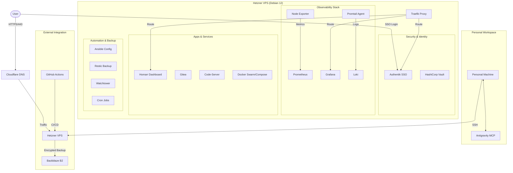

# CavyDev Homelab - Infrastructure as Code

This repository manages the infrastructure and service configurations for my personal homelab, hosted on a Hetzner VPS. This project serves as the technical foundation for my transition toward a Master’s degree in DevOps & Cloud Engineering.

## Architecture

## Infrastructure Components

### 🏗️ Infrastructure as Code (IaC)

- **Terraform**: Provisions the Hetzner VPS and SSH keys.
- **Ansible**: Configuration Management.
  - **Roles implemented**:
    - `security-hardening`: SSH lockdown, UFW, Fail2ban.
    - `users`: Automated user creation and sudo management.
    - `auto-updates`: Unattended security upgrades.
    - `observability`: Deploys Node Exporter and Promtail.
    - `backup`: Configures Restic with Backblaze B2.
    - `maintenance`: Automated server tidying (Docker prune/log-truncate, APT cleanup, Restic verify/prune, 10-min Docker auto-healing).
    - `watchtower`: Automated Docker image updates.

  - **Playbooks**:
    - `bootstrap.yml`: Day 0 setup.
    - `maintenance.yml`: Automated patching and cleanup.

### 🔄 CI/CD (GitHub Actions)

Fully automated pipelines to ensure code quality and security:

- **IaC Linting**: Validates Terraform (`fmt`, `validate`), Ansible (`ansible-lint`), and Docker Compose files on every push.
- **Security Scanning**: `gitleaks` scans every commit for accidental secret exposure.
- **Script Analysis**: `shellcheck` ensures shell scripts are safe and robust.
- **Dependabot**: Automatically keeps Actions and Docker images up to date.

### 🛡️ Security & Backup

- **Identity**: Centralized SSO with Authentik protecting all services.
- **Secrets**: Managed via Ansible Vault and HashiCorp Vault.
- **Backups**: Daily encrypted backups of persistent data to Backblaze B2 using Restic (automated via Ansible).

## Services Overview

| Category | Services |
| :--- | :--- |
| **Edge & Routing** | Traefik (Reverse Proxy), Cloudflare |
| **Identity** | Authentik (SSO), HashiCorp Vault |
| **Observability** | Prometheus, Grafana, Loki, Promtail, AlertManager, Uptime Kuma |
| **Development** | Gitea (Git Mirroring), Code-Server (Remote IDE) |
| **Automation** | n8n, Watchtower |
| **Content** | WordPress (CavyDev Blog), FreshRSS, Filestash |
| **Dashboard** | Homarr |

## Build in Public

I document my infrastructure evolution, technical hurdles, and DevOps journey on my blog:
[cavydev.com](https://cavydev.com)

---
*Maintained by Adam Benyekkou — Senior Support & Junior DevOps.*
